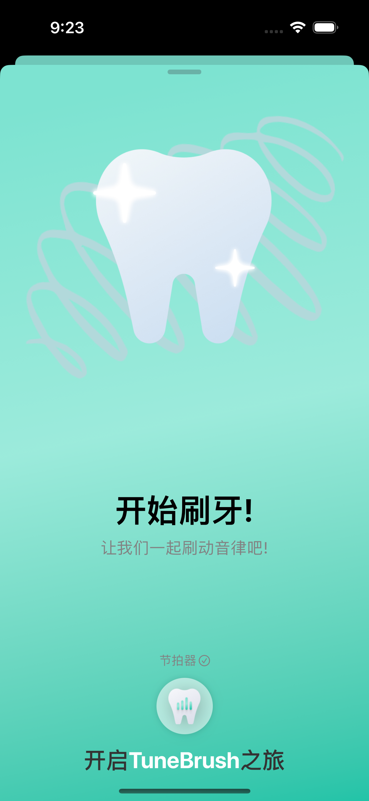
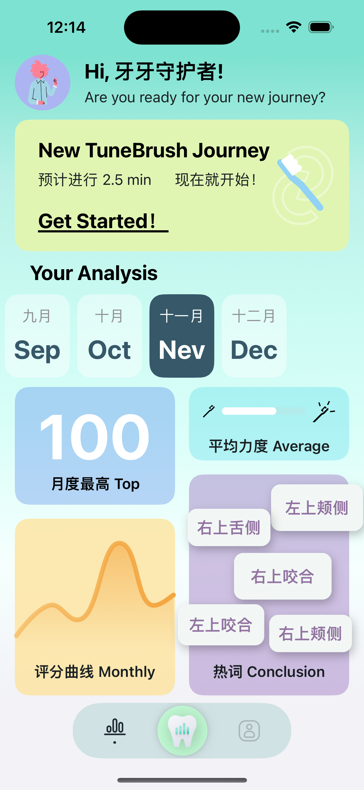

# Brush

## Introduction

TuneBrush is an assisted brushing oral care app for iPhone and Apple Watch that uses the standard brushing vibration frequency on Apple Watch to detect and correct the intensity, frequency, and residence time of each tooth area during brushing. The project mainly uses SwiftUI and [The Composable Architecture](https://github.com/pointfreeco/swift-composable-architecture) framework, using WatchConnectivity and HealthKit to connect iPhone and Apple Watch. Use WatchKit and AVFoundation on Apple Watch to detect brushing actions, remind users, play voice, background music, and run apps in the background.

## Display

